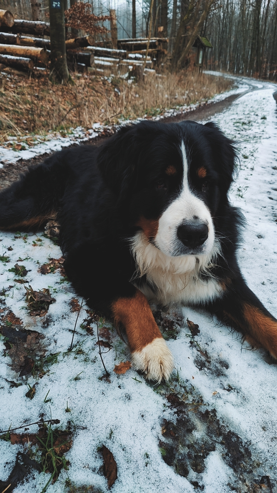
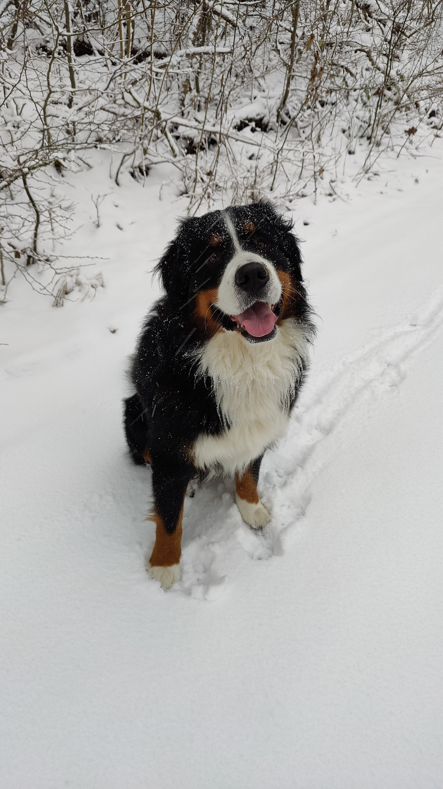
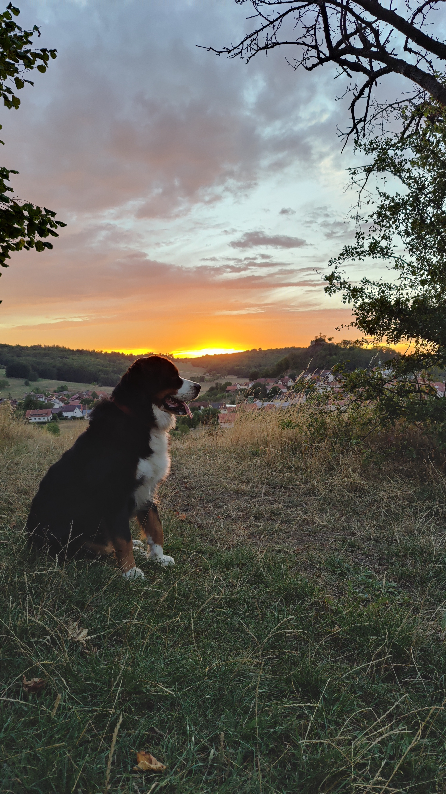

Hello, I'd like to introduce you to a very special part of my life - Samson!

## About Samson

Samson is more than just a pet. He's a cherished companion who brings joy, love, and boundless enthusiasm to my life every day. With his striking tri-color coat, expressive eyes, and gentle disposition, Samson has won the hearts of everyone he meets.

### Samson's Adventures

We love going on adventures together, whether it's a leisurely stroll through the park or a more challenging hike in the mountains. Samson's energy and love for the outdoors are infectious, making every outing an unforgettable experience.

### Fun Facts

- **Breed:** Bernese Mountain Dog
- **Age:** 2 years
- **Personality:** Friendly, loyal, and always up for a game of fetch.
- **Favorite Treat:** Peanut butter-filled Kongs (he can't resist them!).

### Gallery

Here are some snapshots from our adventures:


  
  
  
